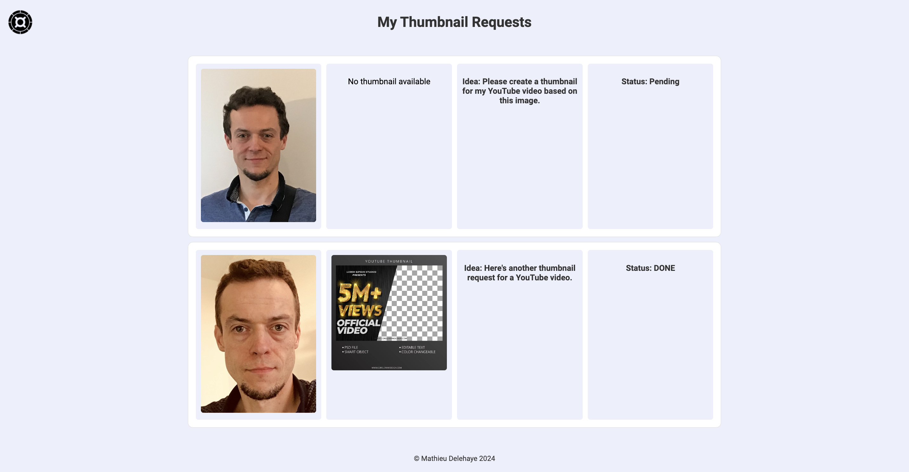

# VideoThumbnailRequest
A Python Django-based SaaS e-commerce platform that enables users to order, pay securely via PayPal, and receive custom video thumbnails directly in their account.

  

  

  

  

